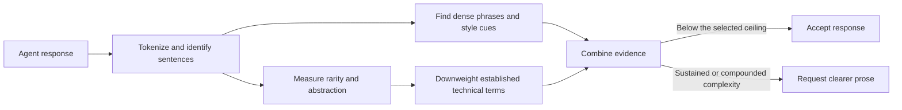

# nopus

nopus helps coding agents replace unnecessarily difficult prose with one clearer answer.

It is not a grammar checker, a technical-term remover, or an AI detector.
It looks for several kinds of complexity that become difficult when they accumulate.

```text
agent response
    -> measure the prose
    -> combine independent signals
    -> accept it or request a clearer version
```

> [!IMPORTANT]
> nopus is under active development.
> Its low-sensitivity profile has completed an initial human calibration and is ready for dogfooding.

## See the difference

### Before

> **Provisional capability:** But Why refuses to use Shared Repository State when an applied migration has changed and rejects structurally unsafe migration definitions before Submission.

### After

> Before submission, But Why checks applied migrations.
> It stops if a migration changed or uses an unsafe structure.

The rewrite keeps the technical meaning.
It removes the stacked abstractions and makes the two conditions easier to find.

<details>
<summary>Show another example</summary>

### Before

> Keep `InteractiveSessionHost` as the execution seam and retain the script's independent late-activation recovery behavior.

### After

> Keep `InteractiveSessionHost` as the boundary that starts the session.
> Keep the script's separate recovery behavior for sessions that activate late.

Terms such as `InteractiveSessionHost` remain unchanged because they identify real code.
The surrounding explanation becomes more direct.

</details>

## What nopus measures

| Signal | Question |
|---|---|
| Conversational rarity | Does the response use many words that are uncommon in ordinary conversation? |
| Broad-web rarity | Are enough of those words also uncommon in general written language? |
| Technical terms | Are uncommon words established computing terms that should receive less weight? |
| Abstract vocabulary | Does the response rely heavily on concepts rather than concrete actions or objects? |
| Abstract sentences | Is difficult wording sustained across several sentences? |
| Noun and modifier stacks | Are several abstract ideas compressed into one phrase? |
| Phrase load | Do dense phrases accumulate relative to the response length? |
| Style cues | Does the response repeatedly use inflated framing, filler, or recurring AI-writing habits? |

A single unusual word, technical phrase, or style cue should not normally cause a rewrite.
nopus combines evidence across the response.
The style matcher automates only a small allowlist of context-free literal cues from the source dataset.
It does not enforce the source author's formatting bans or context-dependent preferences.

```text
"foreign-key integrity"
    technical and contextually useful
    -> keep it

"provisional capability boundary ownership"
    several abstract modifiers
    + uncommon vocabulary
    + similar phrases elsewhere
    -> possible rewrite
```

Response length is not itself a failure.
Current evaluation data shows almost no relationship between response length and normalized abstractness.
nopus therefore measures ratios and phrase load instead of penalizing long answers.

## How a decision is made



The repository analysis entry point is small:

```ts
const result = evaluateProse(response, {
  complexitySensitivity: "low",
});
```

```ts
{
  retry: true,
  metrics: {
    abstractRatio: 0.43,
    uncommonRatio: 0.31,
    phraseLoadPer100Words: 6.2,
  },
  findings: [
    {
      kind: "high-abstractness-sentence",
      text: "...",
      detail: "...",
    },
  ],
}
```

This interface is implemented in `src/evaluate-prose.ts`.

## Complexity sensitivity

nopus will offer a small set of profiles instead of exposing many unrelated thresholds.

| Sensitivity | Intended behavior |
|---|---|
| `low` | Catch only the highest complexity and lower the ceiling. |
| `medium` | Catch sustained or compounded complexity. |
| `high` | Prefer consistently plain language and catch borderline responses. |

All profiles preserve necessary technical terms, commands, identifiers, conditions, and qualifications.

## What happens after a rewrite?

The production integrations allow at most one rewrite so that a bad policy cannot create an infinite loop.

```text
original response
    -> difficult?
        no  -> finish
        yes -> request rewrite
                 -> finish after one rewrite       [current portable policy]
                 -> evaluate again with stored state [possible later policy]
```

A bounded second evaluation could improve strict mode, but it needs an explicit retry limit and observable host behavior.
nopus will not retry without a bound.

## Code map

```text
src/
├── data/                  # Runtime interpretation of packaged data
├── config/                # Shared persistent configuration
├── hook/                  # Claude Code and Codex Stop integration
├── pi/                    # Native Pi lifecycle integration
├── policy/                # Low, medium, and high rewrite sensitivity
├── analysis/              # winkNLP measurements
└── evaluate-prose.ts      # Complete repository evaluation operation

data/                     # Normalized JSON datasets used at runtime
evaluation/               # Calibration against the earlier Python experiment
plugin/                   # Built Pi, Claude Code, and Codex integrations
scripts/                  # Intentional data import and verification
tests/                    # Tests mirroring the runtime source structure
```

The target production structure separates four responsibilities:

```text
data       knows words, ratings, technical terms, and style cues
analysis   measures the response without deciding what is acceptable
policy     applies the selected complexity sensitivity
hook       handles host input, continuation, and rewrite requests
```

The evaluation harness remains separate from runtime code so policy calibration does not affect the plugin interface.

## Current status

| Capability | Status |
|---|---|
| Portable tokenization, POS tags, and lemmas | Working |
| Abstractness and phrase measurements | Working |
| Normalized packaged datasets | Working |
| Technical-term matcher | Working |
| TypeScript rarity calculation | Working |
| AI style-cue matching | Working |
| Sensitivity profiles | Low calibrated; medium and high awaiting boundary review |
| Pi extension | Packaged and verified against Pi 0.84.1 |
| Production Stop hook | Packaged for Claude Code and Codex |
| Authenticated rewrite | Verified with Pi and Codex; Claude Code intentionally not tested |

## Runtime and configuration

The integrations require Node.js 22 or later on `PATH`.
The default complexity sensitivity is `low`.

During Pi development, load the package directly:

```sh
pi -e /path/to/nopus
```

The Pi extension checks each completed response and queues at most one hidden rewrite continuation.
Use `/nopus` to inspect its state.
Use `/nopus check`, `/nopus rewrite`, `/nopus on`, or `/nopus off` while dogfooding.
Use `/nopus low`, `/nopus medium`, `/nopus high`, or `/nopus evidence off` to update shared persistent configuration.

Claude Code exposes `complexitySensitivity` through its native plugin configuration.
Use `/plugin configure nopus@nopus` to change it.

Codex does not currently expose native plugin settings.
Use the nopus configuration skill instead:

```text
$nopus-configure medium
$nopus-configure evidence off
```

Claude Code can use the same skill as `/nopus:nopus-configure medium` or `/nopus:nopus-configure evidence off`.
The skill writes the persistent nopus configuration file at `$XDG_CONFIG_HOME/nopus/config.json`, or the platform user-configuration equivalent.
The file contains:

```json
{
  "complexitySensitivity": "medium",
  "includeEvidence": true
}
```

Rewrite evidence is enabled by default.
When enabled, nopus includes up to three relevant examples from the response without exposing metric percentages or internal labels.
For automation, `NOPUS_COMPLEXITY_SENSITIVITY` and `NOPUS_INCLUDE_EVIDENCE` override native and file configuration.

## Development

Install dependencies and run all current checks:

```sh
pnpm install
pnpm check
```

Regenerate the parity report:

```sh
pnpm evaluate:parity
```

Update all normalized datasets from their checksum-pinned upstream sources:

```sh
pnpm import:data
```

Normal analysis and verification do not download runtime data.

<details>
<summary>Data sources and attribution</summary>

nopus retains normalized JSON rather than the original upstream formats.
The SHA-256 values below identify the exact upstream copies used to produce the normalized datasets.

### Claudisms

`data/ai-style-cues.json` is derived from <https://claudisms.ai/claudisms.md>.
The source describes itself as a living list of AI-writing habits that is free to copy and adapt.
The copy was retrieved on 2026-08-14 and has SHA-256 `f4a09fa849b61712838d3e56c854ddf37a59417823acb348a330721615f73b2b`.

### SUBTLEX-US word frequencies

`data/conversational-word-frequencies.json` is derived from `subtlex-word-frequencies@2.0.0`, available at <https://github.com/words/subtlex-word-frequencies>.
The package derives its data from SUBTLEX-US by Marc Brysbaert and Boris New.
The source paper is “Moving beyond Kučera and Francis: A Critical Evaluation of Current Word Frequency Norms and the Introduction of a New and Improved Word Frequency Measure for American English,” DOI <https://doi.org/10.3758/BRM.41.4.977>.
The source copy has SHA-256 `271c5a5fbf332f60762cfa34b11394427c220099d96c589751b6bc77e5b32c1a`.
The npm package declares the ISC license, which is preserved at `data/licenses/conversational-word-frequencies-ISC.txt`.

### Norvig web word counts

`data/broad-web-word-counts.json` is derived from <https://norvig.com/ngrams/count_1w.txt>.
Peter Norvig publishes the file as part of the data described at <https://norvig.com/ngrams/>.
The counts derive from the Google Web Trillion Word Corpus described by Thorsten Brants and Alex Franz and distributed by the Linguistic Data Consortium.
The source copy has SHA-256 `51df159fd3de12b20e403c108f526e96dbd723d9cabdd5f17955cdc16059e690`.

### Brysbaert concreteness ratings

`data/concreteness-ratings.json` is derived from the ArtsEngine mirror at <https://github.com/ArtsEngine/concreteness>.
The data accompanies Marc Brysbaert, Amy Beth Warriner, and Victor Kuperman, “Concreteness ratings for 40 thousand generally known English word lemmas,” DOI <https://doi.org/10.3758/s13428-013-0403-5>.
The source copy has SHA-256 `0b4082dbd38585b0ee1fd258145b7a50592f8d0d98e5fc6b6844ceef3cd8ecc8`.

### Carpentries Glosario

`data/technical-terms.json` is derived from The Carpentries `glosario` repository at revision `a4a774b6dea3881a7794d63aee10fbb5d34321d1`.
The source repository is <https://github.com/carpentries/glosario>, and its archived releases are available under DOI <https://doi.org/10.5281/zenodo.13589476>.
The source copy has SHA-256 `93a6371add7275d643cacb060ae0b65749d1ffdff329064feeaeaf7152c3715f`.
The data is licensed under Creative Commons Attribution 4.0 International, and the license is preserved at `data/licenses/computing-glossary-CC-BY-4.0.md`.
The Carpentries does not endorse nopus.

</details>
